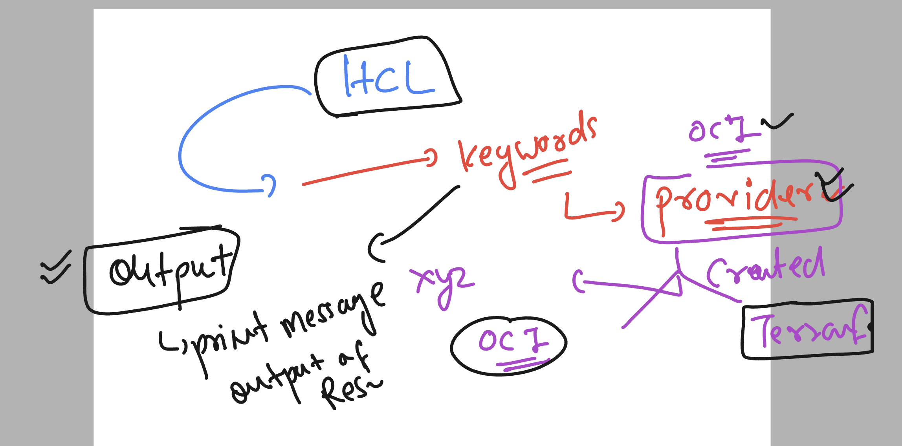

# oke_vodafone_terraform

### Understanding lab connection 


### Introduction to terraform basic 


### Terraform installation on linux host (amazonlinux)

```
sudo yum install -y yum-utils shadow-utils
sudo yum-config-manager --add-repo https://rpm.releases.hashicorp.com/AmazonLinux/hashicorp.repo
sudo yum -y install terraform
```

### installation link 

[click_here](https://developer.hashicorp.com/terraform/install)

### terraform version verify 

```
 terraform version
Terraform v1.6.4
on linux_amd64
```

### provider  / target in terraform 

[click_here](https://registry.terraform.io/browse/providers)

### Oracle cloud tenant and compartment understanding 


### more info 


### creating a directory to write code 

```
mkdir  myterraform_code
[ashu@ip-172-31-95-43 ~]$ cd  myterraform_code/
[ashu@ip-172-31-95-43 myterraform_code]$ ls
[ashu@ip-172-31-95-43 myterraform_code]$ 
```

## Step to setup terraform for OCI 

### create provider.tf  and put details as given below ---> provider.tf

```
provider "oci" {
    region = "ap-mumbai-1"
    tenancy_ocid    = "q"
    user_ocid = "o"
}
```

### to setup RSA key for OCI as per OCI and terraform standard


```
cd  ~/.oci/
[ashu@ip-172-31-95-43 .oci]$ ls
[ashu@ip-172-31-95-43 .oci]$ 
[ashu@ip-172-31-95-43 .oci]$ openssl genrsa  -out private_key.pem  2048
Generating RSA private key, 2048 bit long modulus
..........................................................+++
.......+++
e is 65537 (0x10001)
[ashu@ip-172-31-95-43 .oci]$ ls
private_key.pem
[ashu@ip-172-31-95-43 .oci]$ ls
private_key.pem
[ashu@ip-172-31-95-43 .oci]$ ls -l 
total 4
-rw-rw-r-- 1 ashu ashu 1679 Nov 27 07:21 private_key.pem

[ashu@ip-172-31-95-43 .oci]$ chmod 600 private_key.pem 
[ashu@ip-172-31-95-43 .oci]$ ls
private_key.pem
[ashu@ip-172-31-95-43 .oci]$ ls -l
total 4
-rw------- 1 ashu ashu 1679 Nov 27 07:21 private_key.pem

[ashu@ip-172-31-95-43 .oci]$ openssl rsa -pubout  -in private_key.pem -out public_key.pem 
writing RSA key
[ashu@ip-172-31-95-43 .oci]$ ls
private_key.pem  public_key.pem

```

### terraform OCI setup as per OCI stanadard 


### output keyword for terraform 



## Terrform script run flow 

### Terraform initialization 

```
[ashu@ip-172-31-95-43 oci_terraform]$ ls
provider.tf


[ashu@ip-172-31-95-43 oci_terraform]$ terraform  init 

Initializing the backend...

Initializing provider plugins...
- Finding oracle/oci versions matching ">= 4.0.0"...
- Installing oracle/oci v5.21.0...
- Installed oracle/oci v5.21.0 (signed by a HashiCorp partner, key ID 1533A49284137CEB)

Partner and community providers are signed by their developers.
If you'd like to know more about provider signing, you can read ab
```

### what we get 

```
 ls -a
.  ..  provider.tf  .terraform  .terraform.lock.hcl
```

### .terraform is a db file for terraform resource 

### step plan 

```
terraform  plan 

Changes to Outputs:
  + my-message = "hello world this Ashutoshh with OCI-terraform"

You can apply this plan to save these new output values to the Terraform state, without changing any real infrastructure.

───────────────────────────────────────────────────────────────────────────────────────────────────────────────────────────────

Note: You didn't use the -out option to save this plan, so Terraform can't guarantee to take exactly these actions if you run
"terraform apply" now.

```

### run the script of tf ---apply 

```

terraform apply 

Changes to Outputs:
  + my-message = "hello world this Ashutoshh with OCI-terraform"

You can apply this plan to save these new output values to the Terraform state, without changing any real infrastructure.

Do you want to perform these actions?
  Terraform will perform the actions described above.
  Only 'yes' will be accepted to approve.

  Enter a value: yes


Apply complete! Resources: 0 added, 0 changed, 0 destroyed.

Outputs:

my-message = "hello world this Ashutoshh with OCI-terraform"
```

### so to delete resource use 

```
terraform  destroy 

Changes to Outputs:
  - my-message = "hello world this Ashutoshh with OCI-terraform" -> null

You can apply this plan to save these new output values to the Terraform state, without changing any real infrastructure.

Do you really want to destroy all resources?
  Terraform will destroy all your managed infrastructure, as shown above.
  There is no undo. Only 'yes' will be accepted to confirm.

  Enter a value: yes


Destroy complete! Resources: 0 destroyed.

```

### using auto-approve options 

```
terraform apply   --auto-approve 

Changes to Outputs:
  + my-message = "hello world this Ashutoshh with OCI-terraform"

You can apply this plan to save these new output values to the Terraform state, without changing any real infrastructure.

Apply complete! Resources: 0 added, 0 changed, 0 destroyed.

Outputs:

my-message = "hello world this Ashutoshh with OCI-terraform"
```

### more 

```
terraform destroy    --auto-approve 

Changes to Outputs:
  - my-message = "hello world this Ashutoshh with OCI-terraform" -> null

You can apply this plan to save these new output values to the Terraform state, without changing any real infrastructure.

Destroy complete! Resources: 0 destroyed.

```

### calling output section in tf script 

```
 terraform output 
my-message = "hello world this Ashutoshh with OCI-terraform"
[ashu@ip-172-31-95-43 oci_terraform]$ 

```


