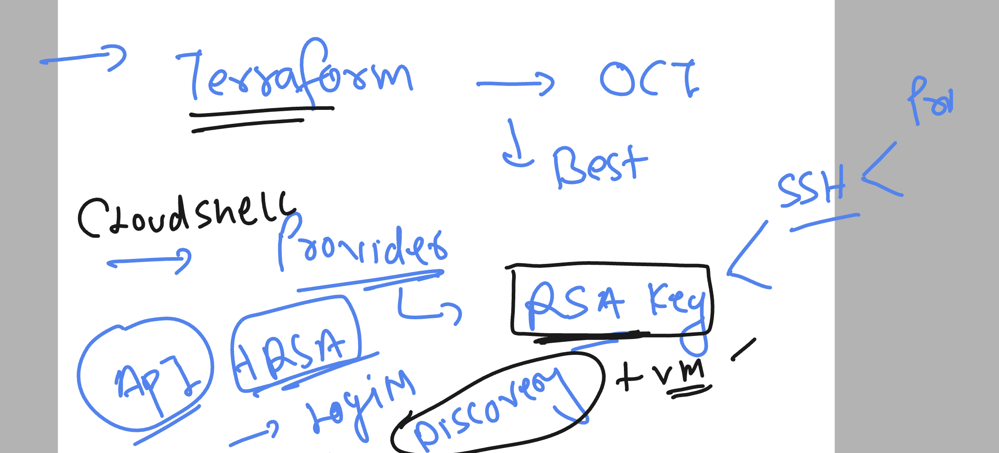
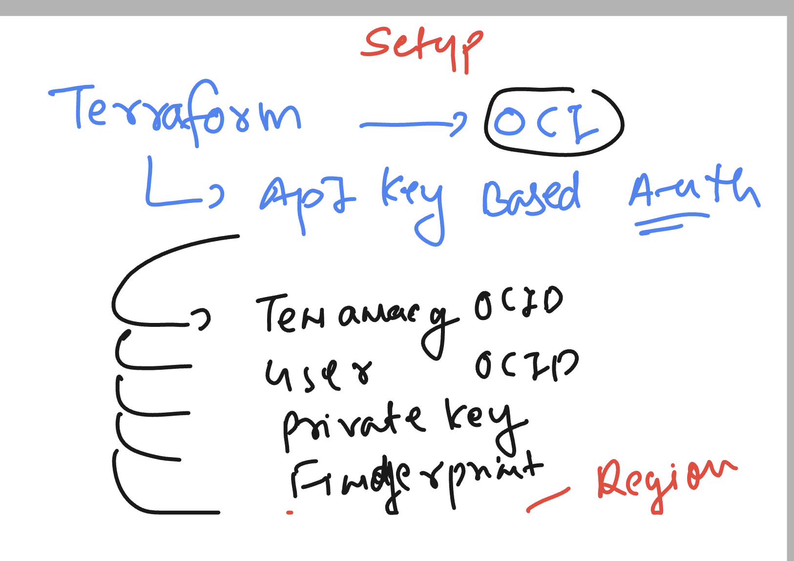

# oke_vodafone_terraform

### Understanding lab connection 


### Introduction to terraform basic 


### Terraform installation on linux host (amazonlinux)

```
sudo yum install -y yum-utils shadow-utils
sudo yum-config-manager --add-repo https://rpm.releases.hashicorp.com/AmazonLinux/hashicorp.repo
sudo yum -y install terraform
```

### installation link 

[click_here](https://developer.hashicorp.com/terraform/install)

### terraform version verify 

```
 terraform version
Terraform v1.6.4
on linux_amd64
```

### provider  / target in terraform 

[click_here](https://registry.terraform.io/browse/providers)

### Oracle cloud tenant and compartment understanding 


### more info 


### creating a directory to write code 

```
mkdir  myterraform_code
[ashu@ip-172-31-95-43 ~]$ cd  myterraform_code/
[ashu@ip-172-31-95-43 myterraform_code]$ ls
[ashu@ip-172-31-95-43 myterraform_code]$ 
```

## Step to setup terraform for OCI 

### create provider.tf  and put details as given below ---> provider.tf

```
provider "oci" {
    region = "ap-mumbai-1"
    tenancy_ocid    = "q"
    user_ocid = "o"
}
```

### to setup RSA key for OCI as per OCI and terraform standard



```
cd  ~/.oci/
[ashu@ip-172-31-95-43 .oci]$ ls
[ashu@ip-172-31-95-43 .oci]$ 
[ashu@ip-172-31-95-43 .oci]$ openssl genrsa  -out private_key.pem  2048
Generating RSA private key, 2048 bit long modulus
..........................................................+++
.......+++
e is 65537 (0x10001)
[ashu@ip-172-31-95-43 .oci]$ ls
private_key.pem
[ashu@ip-172-31-95-43 .oci]$ ls
private_key.pem
[ashu@ip-172-31-95-43 .oci]$ ls -l 
total 4
-rw-rw-r-- 1 ashu ashu 1679 Nov 27 07:21 private_key.pem

[ashu@ip-172-31-95-43 .oci]$ chmod 600 private_key.pem 
[ashu@ip-172-31-95-43 .oci]$ ls
private_key.pem
[ashu@ip-172-31-95-43 .oci]$ ls -l
total 4
-rw------- 1 ashu ashu 1679 Nov 27 07:21 private_key.pem

[ashu@ip-172-31-95-43 .oci]$ openssl rsa -pubout  -in private_key.pem -out public_key.pem 
writing RSA key
[ashu@ip-172-31-95-43 .oci]$ ls
private_key.pem  public_key.pem

```

### terraform OCI setup as per OCI stanadard 




