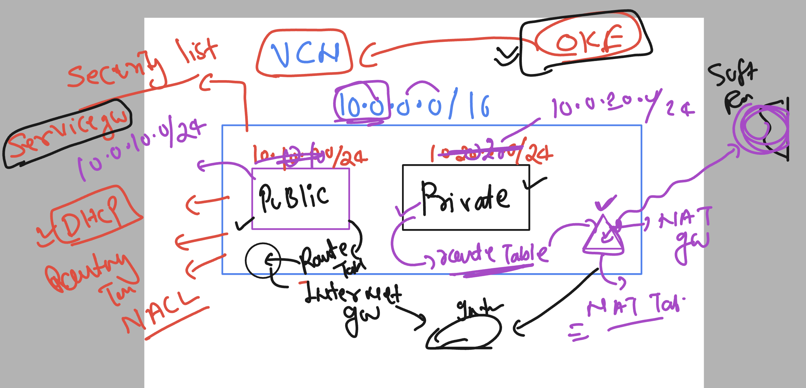
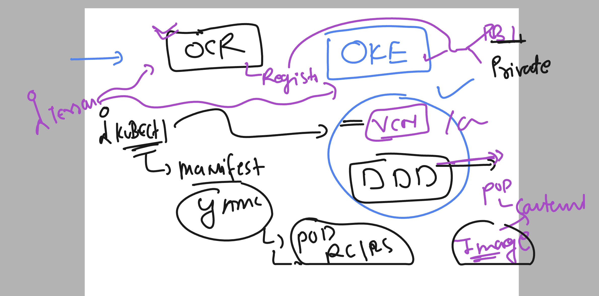
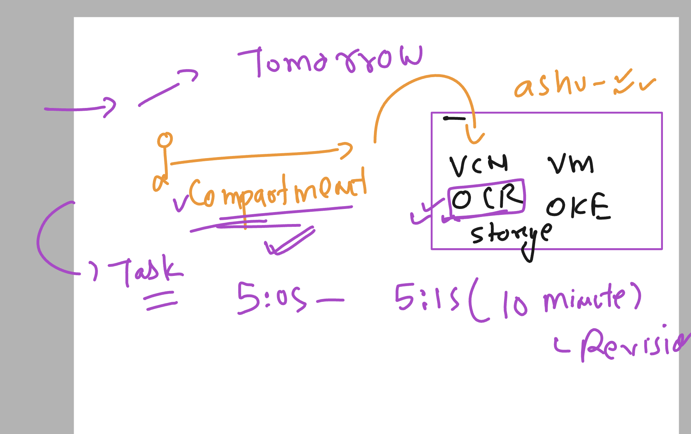

# oke_vodafone_terraform

### get started


### terraform lab connect


### Introduction to VCN with terraform for OKE 



### creating Entire VCN --with standard of OCI 

## Starting with OCR understanding 



### creating a new directory structure 

```
m]$ ls
oci-vcn  output.tf  provider.tf  terraform.tfstate  terraform.tfstate.backup  var_provider.tf  vcn.tf  vm_create.tf  vm_var.tf  vnc_var.tf
[ashu@ip-172-31-95-43 oci_terraform]$ 
[ashu@ip-172-31-95-43 oci_terraform]$ 
[ashu@ip-172-31-95-43 oci_terraform]$ mkdir  ocr
[ashu@ip-172-31-95-43 oci_terraform]$ cp -v provider.tf  ocr/
‘provider.tf’ -> ‘ocr/provider.tf’
[ashu@ip-172-31-95-43 oci_terraform]$ cp -v var_provider.tf  ocr/
‘var_provider.tf’ -> ‘ocr/var_provider.tf’
[ashu@ip-172-31-95-43 oci_terraform]$ cd ocr/
[ashu@ip-172-31-95-43 ocr]$ ls
provider.tf  var_provider.tf
[ashu@ip-172-31-95-43 ocr]$ 


```

### using personal compartment to create resources




